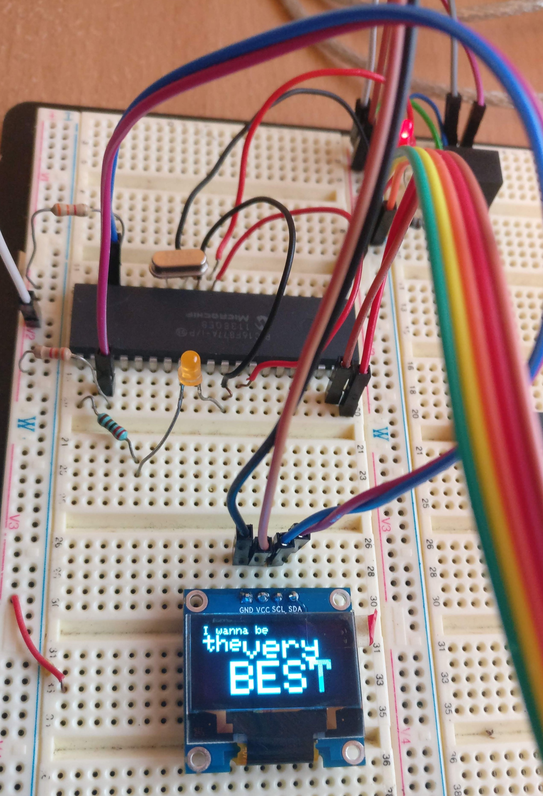

# pic16f877a-ssd1306-oled
Making an SSD1306 work in the constrained PIC16F877A

This was a bit of a challenge. There's plenty of code online for driving the SSD1306, but most of it uses buffered memory (see the `_buffered.h` example for this).
But these don't work on a device like the PIC16F677A, why?

# The problem

Unfortunately, the PIC16F677A has a grand total of 128 bytes of SRAM. Yes, you read that right, _128 bytes_.
The SSD1306 module has 128x64 pixels. Even if it was 1 bit per pixel, I'd still need 1024 bytes of memory to store a screenbuffer.

So, the PIC16F677A just _doesn't have enough data memory_ for screen buffering.

So what is a person to do?

# The solution

Using the resources from 
* https://cdn-shop.adafruit.com/datasheets/SSD1306.pdf
* https://simple-circuit.com/ssd1306-oled-ccs-c-library/
* https://simple-circuit.com/pic18f4550-ssd1306-oled-display/

And then
* https://circuitdigest.com/microcontroller-projects/i2c-communication-with-pic-microcontroller-pic16f877a
for I2C,

I ported and edited and mangled the original source codes (some remnants are stored under `/unused`) so that the PIC would fit and support a subset of operations of the original SSD1306 driver operations without any data buffering at all! Hooray!
(Wait, is this a good thing?)

If you're interested, the useful code is in `ssd1306_unbuffered.h` and `i2c.h`.

Anyway, it works! Woohoo!

